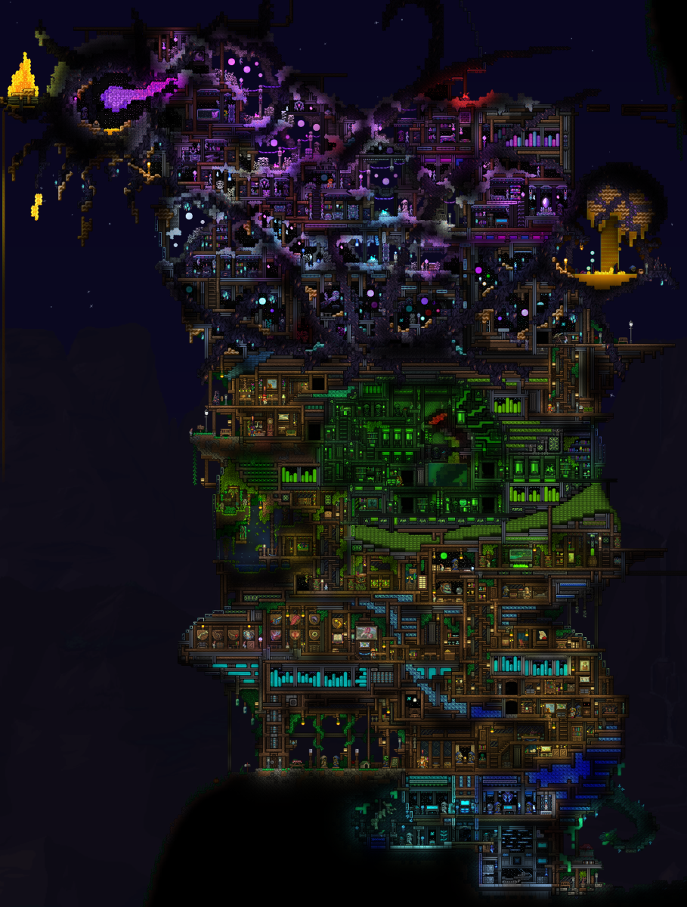

this is my terraria base

Of late I’ve been using the Debian pastezone pastebin service and figured that it would be pretty cool to host my own pastebin service. I searched around on github and gitlab for a PHP based pastebin that would hook up with my mysql database service.

I did find a few projects, but I didn’t like the way they looked or operated. I think the one I liked the most though was this old project, “[php-pastebin-v3.”](https://github.com/atmoner/php-pastebin-v3) It’s an archived project, but I don’t care if projects like these are abandoned; they’re simple services that honestly don’t need some continuous development.

Despite liking this one, I wanted something that was a little more simple, just like Debian Pastezone, because it can be accessed by simple browsers, even text based browsers! Poking around on Debian pastezone brought me to the project source, which is a Perl and CGI based service.

This is quite similar to my Xapian Omega internal site indexing and search service, which the Omega web front-end is a CGI based application. I wrote a short blog on it awhile ago [here, if you’re interested.](https://www.cozynet.org/blogs/20230802_blog.html)

I like these sorts of simplistic backend services because they just werk! Now I am a bit leery to the “security” of it all, or perhaps its unbeknownst lack thereof; but generally the security boils down to the web server itself and what might be unknowingly permitted. Now this is just a hobby site so if it gets wrekt then oh well, but it makes a good learning experience none the less. So check out the CozyNet Pastezone!

I think having this is especially nice for the IRC where the occasional snippets of code and configurations are pasted into the channel. I’ve modified the pastebin service to include an address bar because I wanted to make the pastebin into an iframe-able widget that wouldn’t require the user to open a new tab from their browser; they can just load the paste link directly within the search input and hit “Go” to load the page. You can also somewhat navigate from outside of it onto other CozyNet web pages, which is kinda funny, but out of scope for it’s purpose. You can see this in action on the CozyNet homepage below the IRC chat window in a toggle button that reveals the pastebin. You can produce links and load links directly within the iframe without ever needing to leave the page which I think it’s really neat!

Or alternatively, you can just go [directly to the pastebin service](https://pastezone.cozynet.org/) if that floats your boat.

I’m not finished with tweaking the pastebin service by the way. It still needs some improvement in the theme department, and I’m considering disabling the commenting system for hidden pastes since it doesn’t exactly work very well; I mean, it does work, but it runs into some weird session error after making a comment, which you can resolve by simply going back and refreshing the page to see the submitted comment. Additionally, I’m thinking of also integrating my captcha system that I use for the comment service to cut out any potential C&C bot submissions.

Thanks for reading my blog!

Date: 2024-06-24